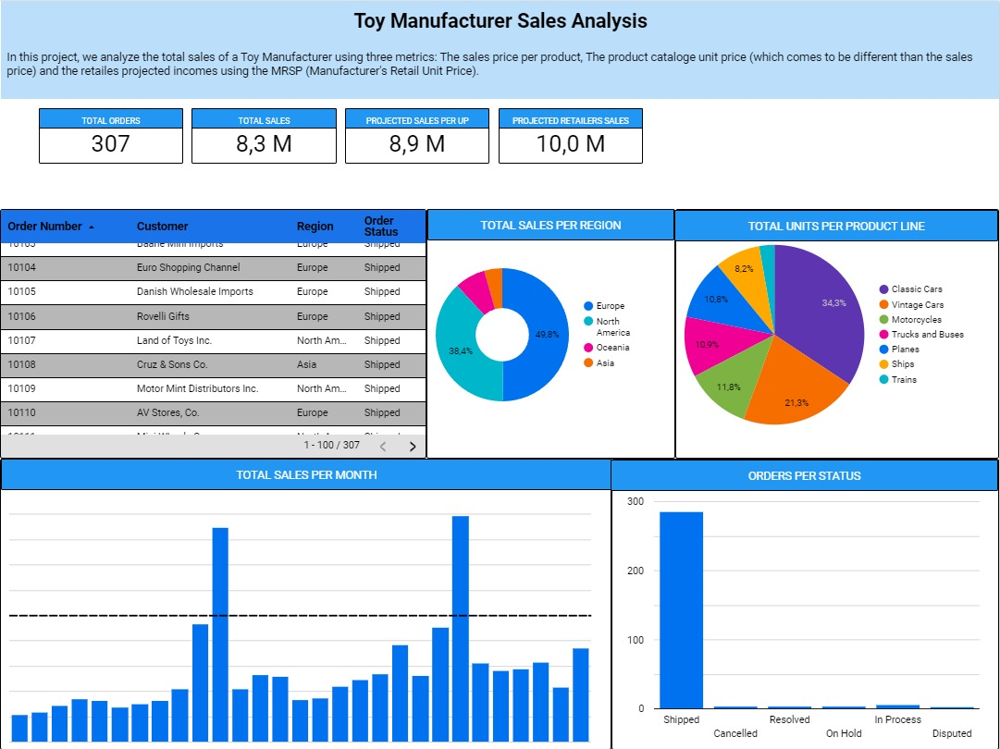

# OrdersAnalytics

## An SQL project that analyze the sales info of a Toy Manufacturer.

This project is focused on the sales data analysis of a Toy Manufacturer. 

### The project covers the following main topics:

1. Data storage. 
	- As part of my Database course @ TecDeMonterrey, I have the purpose to teach my students a proper way to store data. As a kickstar, I created a database model to properly store the sales data.
2. Data cleaning
	- I found out some data that must be cleaned up, such as unused data, unclear data.
	- I will teach you how to manage all this
	- Also, data was dated on 2002 to 2005. I just made it "a more recent" case.
3. Load data on Looker Studio. I have no conflicts with other data visualization tools but, @ Tec De Monterrey, I have archived a good student reception with Google Looker Studio.
4. Data Analysis. We included 2 main dashboards focused on:
	- Total sales per region, month and total units per product line (Where's my money?)
	- Total orders per customer
	- Each of these dashboards includes an SQL query that tranform data from values to business information.

## Final Report

The final Looker Report is at: https://lookerstudio.google.com/reporting/67fd6a27-fe32-4730-af21-da0a9ebdc080/page/7pqwD

